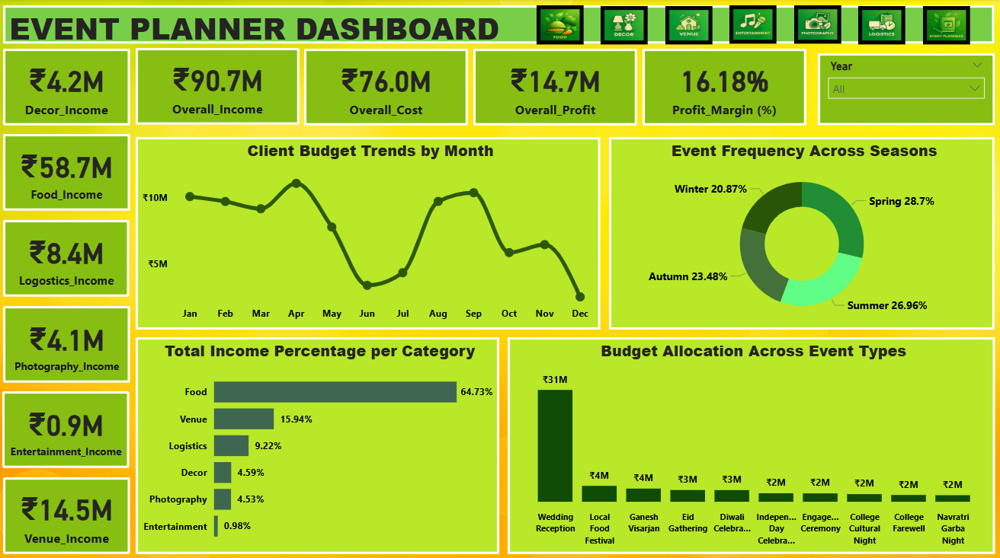
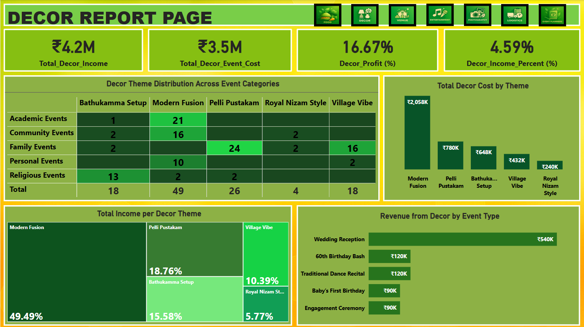
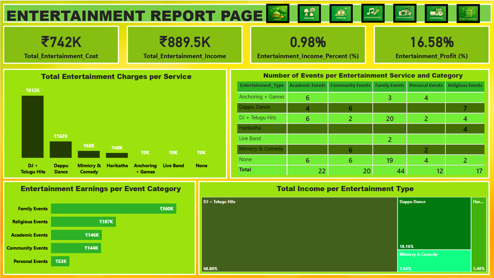
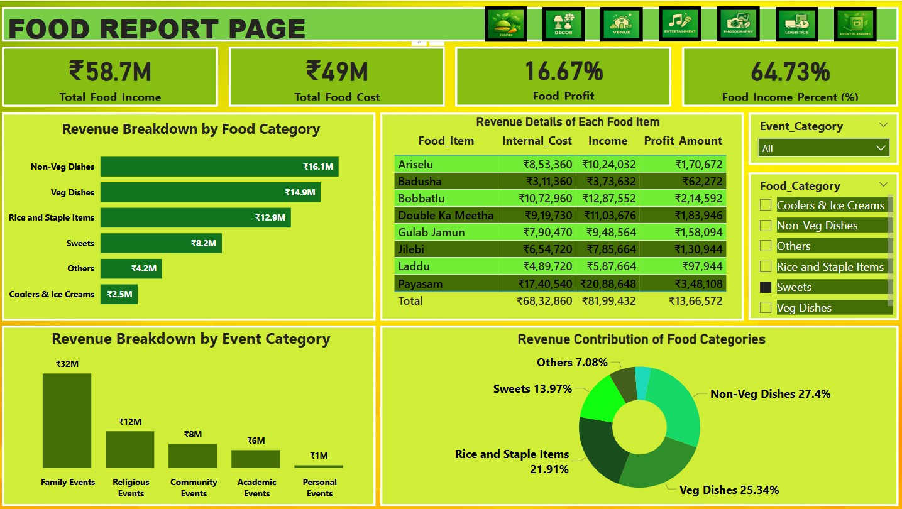
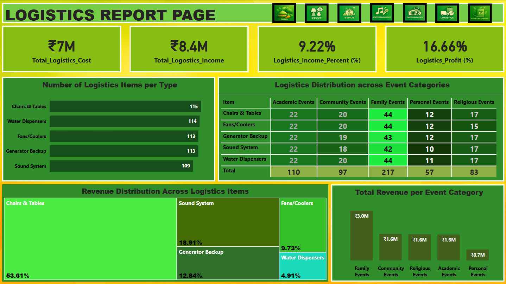
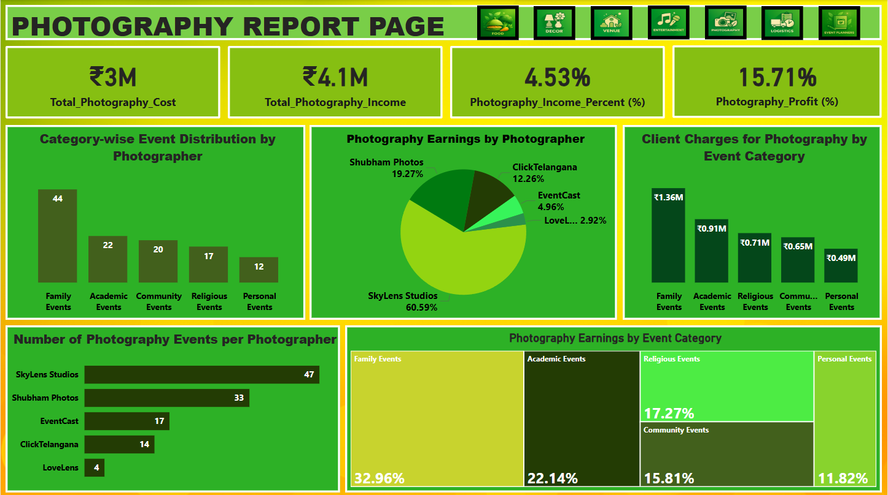
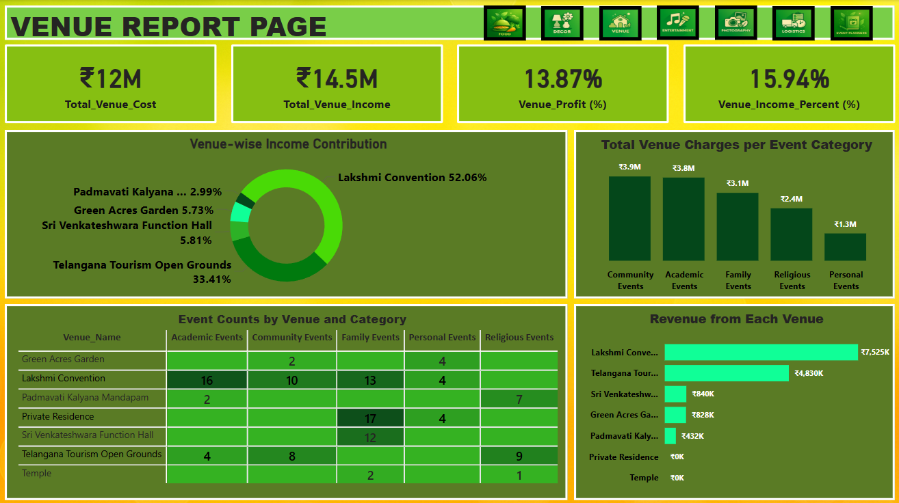

# Akshrav_Event_Planning_Analytics

## Overview
This project analyzes event data from **Akshravi Event Planners** (115 events from 2023–2025) to uncover trends in **client budgets, venue performance, event categories, and revenue distribution**.  
Insights from this analysis help event planners make informed decisions, optimize resources, and improve client satisfaction.  

> **Note:** All data is simulated for learning purposes.

---

## Project Workflow
1. **Data Collection** – Event and order details were collected in Excel.  
2. **Data Cleaning & Transformation (ETL)** – Power Query in Excel was used to clean, transform, and organize the data.  
3. **Data Import to Power BI** – Cleaned datasets were imported to Power BI for analysis.  
4. **Analysis & Visualization** – DAX measures and interactive dashboards were created to derive insights.

---

## Dataset & Tables
- **event_Master** – Main table with core details of all events.  
- **Order Tables:**  
  - food_orders  
  - logistics_orders  
  - decor_orders  
  - venue_orders  
  - photography_orders  
  - entertainment_orders  
- **Catalogues Tables:** Master details for each category (food, venue, decor, photography, entertainment, logistics).

---

## Key Features
- Event-wise and category-wise **budget and revenue analysis**  
- Venue-wise **income and profitability analysis**  
- Seasonal trends and **client preference patterns**  
- **Interactive dashboards** with DAX measures for key metrics  
- **Clean and well-structured data** ready for further analysis  

---

## Technologies Used
- **Excel** – Data collection, cleaning, and ETL (Power Query)  
- **Power BI** – Analysis, dashboards, and visualizations  
- **DAX** – Measures for advanced analytics  

---

## Insights
 - The data highlights how Food is the undeniable centerpiece of event planning in Telangana, contributing 64.73% of the total income. 
 - The top events by income include Weddings and Wedding Receptions (₹31M), Local Food Festivals (₹4M), Ganesh Festival(₹4M), Eid Gatherings (₹3M), Diwali Celebrations (₹3M), and Independence Day events.
 - The Overall Income of ₹90.7 million, Overall Cost of ₹76.0 million, and an Overall Profit of ₹14.7 million, resulting in a Profit Margin of 16.18%.
 - When comparing data from 2023 to 2025, it’s clear that income reaches its highest point between January and April, with April marking the peak month.
 - The Event Frequency Across Seasons visual strengthens this observation — Spring emerges as the most active season, confirming it as the heart of Telangana’s marriage and celebration period.
---

## Dashboard Visuals

**Event Dashboard**  

**Decor Report**  

**Entertainment Report**  

**Food Report**  

**Logistics Report**  

**Photography Report**  

**Venue Report**  

---

## Usage
1. Open the Power BI dashboard(You can download it)
2. Explore visuals in the `/Dashboards` folder to understand key insights and trends.  

---

## Author
**Akshaya Mekala** – Data enthusiast passionate about transforming raw data into actionable business insights.  

